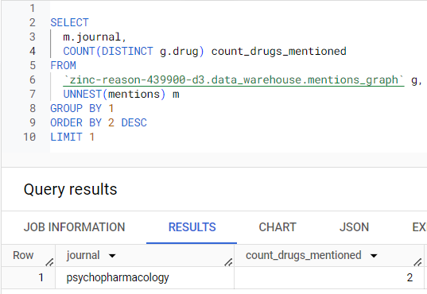

# Python et Data Engineering : DAG Airflow

### Table des Matières

1. [Introduction](#Introduction)
2. [Structure du projet](#Structure-du-projet)
3. [Exécution de La Pipeline](#Exécution-de-La-Pipeline)
4. [Resusltats](#Resusltats)

## Introduction

Ce repertoire contient mon travail pour l'exercice Python et Data Engineering.

Dans cet exercice, j'ai implémenté une pipeline qui permet traiter des données pour générer les relations entre les médicaments et leur mention dans les journaux scientifiques en utilisant en utilisant Google BigQuery et Airflow pour l'orchestration. Cette pipeline charge les données depuis Google Cloud Storage (GCS), les prétraite dans BigQuery et génère un graphe final des mentions, qui est ensuite exporté vers GCS.

Cette approche est la plus adaptée pour des données de grande taille (plusieurs To).

## Structure du projet

La structure du projet est organisée comme suit:

```plaintext
airflow_home/
├── dags/
│   └── drug_mentions_pipeline_v3.py      # Fichier DAG orchestrant la pipeline
├── queries/                              # Dossier contenant les requêtes SQL pour le prétraitement et la génération du graphe de mentions
│   ├── preprocess_pubmed.sql             # Script SQL pour le prétraitement des données PubMed
│   ├── preprocess_trials.sql             # Script SQL pour le prétraitement des données d'essais cliniques
│   └── generate_mentions_graph.sql       # Script SQL pour générer le graphe final des mentions
└── data/
    └── raw/                              # Dossier de données brutes (fichiers d'entrée dans GCS)
```

## Exécution de La Pipeline

### Étape 1 : Configurer les Variables dans Airflow

Définissez les variables suivantes dans Airflow avec les détails de votre projet :

- `project_id`, `raw_dataset`, `staging_dataset`, `datawarehouse_dataset`, `composer_bucket`.

### Étape 2 : Placer les Fichiers dans GCS

Placer tous les fichiers de ce repertoire (`data/*` et `dags/*`) dans le dossier root de Airflow (par exemple, ~/airflow, ou directement dans le Bucket GCS si vous utilisez Cloud Composer).

### Étape 3 : Exécuter le DAG

Déclenchez le DAG manuellement pour démarrer le pipeline.

L'image ci-dessous montre le graphe de la pipeline dans Airflow :


## Resultats

Après l'exécution du DAG, on obtient une table BigQuery contenant les relations entre les médicaments et les journaux scientifiques, ainsi qu'un fichier JSON exporté dans GCS représentant le graphe des mentions.

L'image ci-dessous montre une partie de la table BigQuery générée :


## Traitement ad-hoc

La table BigQuery générée peut être utilisée pour des analyses ad-hoc. Voici quelques exemples de requêtes que l'on peut exécuter :

- Extraire le nom du journal qui mentionne le plus de médicaments différents.

```sql
SELECT
  m.journal,
  COUNT(DISTINCT g.drug) count_drugs_mentioned
FROM
  `<projet>.data_warehouse.mentions_graph` g,
  UNNEST(mentions) m
GROUP BY 1
ORDER BY 2 DESC
LIMIT 1
```



- Pour un médicament donné, trouver l’ensemble des médicaments mentionnés par les mêmes journaux référencés par les publications scientifiques (PubMed) mais non les tests cliniques (Clinical Trials).

```sql
WITH
  only_pubmed AS (
  SELECT
    DISTINCT drug,
    m.journal
  FROM
    `<projet>.data_warehouse.mentions_graph` g,
    UNNEST(mentions) m
  WHERE
    ARRAY_LENGTH(m.PubMed) > 0
    AND ARRAY_LENGTH(m.`Clinical Trials`) = 0)
SELECT
  o1.drug,
  ARRAY_AGG(o2.drug) related_drugs_pub_med_only
FROM
  only_pubmed o1
  JOIN only_pubmed o2
  ON o1.drug <> o2.drug AND o1.journal = o2.journal
GROUP BY
  o1.drug
```


#### Remarque

J'ai du transformer le fichier `data/raw/pubmed.json` en NEWLINE_DELIMITED_JSON pour pouvoir l'importer dans BigQuery. Pour ce faire, j'ai utilisé la commande suivante (commande bash fonctionne egalement sur Windows avec Git Bash) :

```bash
jq -c '.[]' pubmed.json > pubmed_newline.json && mv pubmed_newline.json pubmed.json
```

Les fichiers de données sont disponibles dans le dossier `data/` du repo GitHub. Ce n'est pas une bonne pratique de les stocker dans le repo, mais puisque les données ne sont pas sensibles, et ne sont pas volumineuses, je les ai inclus dans le repo pour faciliter l'exécution du code.
